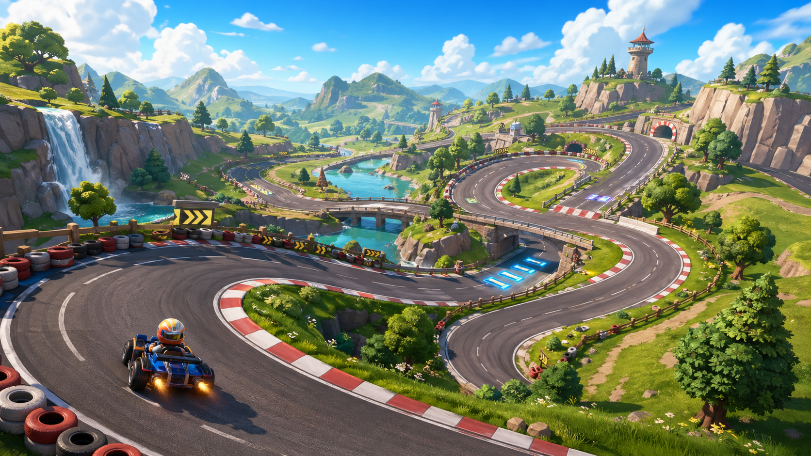

# MarbleRush Scenic Track Visual Plan

This plan treats visual quality as an engine validation target. The goal is not to finish racing gameplay first; the goal is to prove that voplay can render a large, attractive, stylized kart-racing scene with real assets, real materials, and a coherent outdoor track.

## Concept Reference



## Target

MarbleRush should open into a bright, readable, large-scale kart racing environment:

- a continuous asphalt track with sweeping banked turns
- road shoulders and grass transitions that look intentional
- terrain with hills, valleys, and distant landmarks
- skybox, clouds, fog, and far scenery that create depth
- track-side props such as arrow signs, tire barriers, fences, boost pads, flags, rocks, and trees
- rich cartoon materials that survive lighting in both web and native runners

The scene should stop reading as a test sandbox. It should read as the first playable art-direction slice of a real kart racing game.

## Non-Goals

- Do not solve race rules, laps, AI, items, progression, or menus in this pass.
- Do not hand-place a small arena of primitives and call it a track.
- Do not rely on color-only boxes for final visual validation.
- Do not tune the full driving model except where visual validation requires the camera to move through the scene.

## Engine Capabilities Being Tested

### Scene Scale

The reference scene must validate that voplay can handle a large outdoor racing layout with foreground, midground, and background content.

Acceptance:

- the first camera view contains visible foreground track, midground terrain, and distant scenery
- fog blends distant terrain into the sky instead of hiding it abruptly
- the track remains readable at gameplay camera distance

### Track Mesh

The visible road must come from generated or imported mesh assets, not primitive boxes.

Acceptance:

- road mesh follows a continuous closed-loop path
- UVs follow track distance so asphalt texture is continuous
- road edges include shoulders or curbs
- visual mesh and collision mesh can be separate
- mesh assets are loadable through the normal asset pack path

### Terrain

Terrain should support the track composition instead of being a flat board.

Acceptance:

- terrain has broad elevation changes and surrounding landforms
- road sits on or cuts into terrain in a believable way
- grass shoulders allow visual recovery zones around the road
- terrain chunks or generated terrain remain compatible with `TrackAsset`

### Materials

This scene should be a practical material-pipeline test.

Acceptance:

- road, grass, curb, boost pad, signs, and props use texture assets
- road and grass use normal maps or equivalent surface detail where useful
- sampler settings preserve intended tiling and sharpness
- source colors remain recognizable after lighting and fog
- no major asset renders black, washed out, or untextured in web runner

### Lighting

The scene should validate a bright stylized outdoor racing profile.

Acceptance:

- the scene is bright without being pale or overexposed
- shadows add depth without crushing dark areas
- road texture remains visible in sun and shadow
- web and native exposure should be in the same class

### Asset Packaging

The scene should prove that vopack can carry real visual content.

Acceptance:

- concept-driven assets are stored under `assets/`
- pack generation includes all track, terrain, texture, model, skybox, and prop dependencies
- missing dependencies fail before runtime rendering
- local web runner loads the packed assets without ad hoc paths

## Implementation Plan

### Phase A: Visual Slice Contract

Define the exact scenic track slice as data:

- `TrackAsset` entry for the scenic track
- centerline with wide sweeping curves and bank hints
- terrain/mesh dependency list
- prop placement metadata or a simple placement tool
- lighting profile overrides for this scene

Output:

- `assets/maps/scenic_track/track.json`
- validation command for scenic track dependencies

### Phase B: Generated Visual Assets

Create deterministic generated assets for the first art pass:

- road mesh
- collision mesh
- curb or shoulder mesh
- terrain heightmaps or terrain chunks
- boost pad mesh or decal
- arrow sign mesh
- tire barrier mesh
- simple tree, rock, and fence meshes

Output:

- generated assets under `assets/maps/scenic_track/` and `assets/models/`
- pack script updated to include them

### Phase C: Material and Lighting Pass

Apply a stylized material set:

- asphalt albedo and normal
- grass albedo and normal
- curb texture
- boost pad emissive or saturated material
- sign and barrier materials
- scenic skybox and fog settings

Output:

- packed textures and material overrides
- a reproducible screenshot exposure check

### Phase D: MarbleRush Integration

Make the scenic track the visual reference scene:

- MarbleRush loads the scenic track through `TrackAsset`
- camera starts at a composed view of the track
- existing kart can spawn on the scenic track
- debug overlay can be toggled without affecting the visual pass

Output:

- runner opens directly into the scenic track
- old demo map path is no longer the default visual reference

### Phase E: Acceptance Capture

Capture the scene in web and native runners.

Acceptance:

- web runner shows textured road, terrain, props, sky, and fog
- no black track, missing texture, or flat-background-only failure
- screenshot reads close to the concept reference in composition and color intent
- `vo check .` passes for MarbleRush
- voplay reference demo and relevant voplay tests still pass

## Visual Bar

The scene is acceptable when a screenshot communicates these three things immediately:

1. This is a large kart racing course, not a sandbox.
2. The engine can render textured stylized outdoor assets consistently.
3. The track has landmarks, terrain depth, and enough art direction to justify further gameplay work.

## Proposed File Layout

```text
MarbleRush/
  docs/
    scenic-track-visual-plan.md
    images/
      scenic-track-concept.png
  assets/
    maps/
      scenic_track/
        track.json
        terrain/
        meshes/
        textures/
    models/
      scenic_props/
  tools/
    generate_scenic_track.mjs
    validate_track.vo
    pack_assets.vo
```

## First Buildable Step

Build `tools/generate_scenic_track.mjs` to output a closed-loop visual track package:

- generated road mesh with continuous UVs
- matching collision mesh
- terrain heightmap or chunks
- initial asphalt and grass textures
- `track.json` referencing all generated assets

Then wire it into `tools/pack_assets.vo` and load it from MarbleRush as the default visual reference scene.

## Implementation Status

Started:

- `tools/generate_scenic_track.mjs` generates the first scenic track package.
- Generated assets live under `assets/maps/scenic_track/`.
- The generated track is an 863m closed loop with road mesh, collision mesh, terrain heightmap, grass texture, embedded road albedo/normal textures, boost pad surface, curbs, trees, rocks, fences, arrow signs, tire barriers, and distant hills.
- Scenic terrain now carries a four-layer splat material through `track.json`/`map.json`: grass, meadow, dirt, and rock layers each provide albedo, normal, metallic-roughness, UV scale, and normal scale. This validates voplay's heightfield terrain material path beyond a single flat grass texture.
- The tire barrier art has moved from upright placeholder torus rings to concept-reference horizontal tire stacks with colored rubber albedo, rubber normals, black tire holes, raised ribs, and groove geometry.
- `tools/pack_assets.vo` validates and packs both `demo_track` and `scenic_track`.
- MarbleRush now attempts to load `maps/scenic_track/track.json` first and falls back to `demo_track`.
- `tools/validate_track.vo` defaults to the scenic track.

Current verification:

- `vo check .` passes for MarbleRush.
- `vo run tools/validate_track.vo` passes with zero warnings on the scenic track.
- The in-app runner displays the scenic track with textured road, curbs, terrain, trees, distant hills, and the kart.
- The first rounded/materialized hero trackside marker is generated into `scenic_props.glb` and verified in the in-app runner.
- Hero material proof screenshots are saved in `docs/images/hero-marker-*.png`.
- The scenic lighting profile has been retuned for a brighter key/fill daylight pass with softer shadows; the current lit proof is `docs/images/hero-marker-lit-lighting-pass.png`.
- F5 toggles a hero inspection camera in the runner; the current tire close-up proof is `docs/images/hero-marker-tire-closeup.png`.

Known visual gaps for the next pass:

- Some props are still first-pass procedural shapes and need more refined silhouettes.
- The hero marker is no longer raw debug geometry; its tire stack is now the first close-up detail benchmark, while the surrounding sign body and minor props still need the same authored-detail treatment.
- Distant hills are simple low-poly forms; they should eventually become a proper background-landmark set.
- The vopack close path has been optimized enough for this asset set, but it should stay on the watch list as visual content grows.
